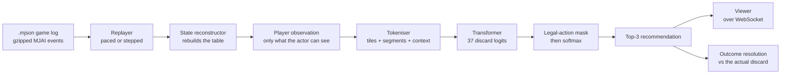

# MahjongMind

A Riichi Mahjong discard-ranking system. It learns which tile a human would
discard from the observable game state, and streams recorded games through the
model in real time so each recommendation can be compared against what the
player actually did.

**[Live demo →](https://mahjong-mind-908350631195.asia-southeast1.run.app)**
Pick a game and watch it play. The panel on the right shows the model's top-3
discards with probabilities; when the discard lands, the tile actually chosen
turns green with the model's rank for it.

> Scales to zero when idle, so the first visit after a quiet period waits a few
> seconds for a cold start.

---

## Results

A transformer trained on 500,000 discard decisions from 2017, compared against
three non-learned baselines and an MLP. All five scored on the same fixed
sample: 300,000 decisions from 2018.

| Model | Top-1 | Top-3 | MRR | Cross-entropy |
| --- | ---: | ---: | ---: | ---: |
| Random legal | 14.5% | 33.0% | 0.323 | 2.227 |
| Most-common legal | 34.4% | 63.2% | 0.532 | 2.006 |
| Tile efficiency (shanten/ukeire heuristic) | 50.8% | 82.2% | 0.680 | 1.602 |
| MLP (928-feature dense encoding) | 56.5% | 81.5% | 0.709 | 1.324 |
| **Transformer (tokenised sequence)** | **62.8%** | **87.4%** | **0.762** | **1.097** |

Evaluated once against a fully held-out year — 2019, never used for training or
any selection decision — the transformer scored **62.58% top-1**, against
62.84% on validation. A 0.26-point gap is ordinary sampling variation, and it
is the strongest generalisation evidence in the project.

The model's clearest weakness is defensive play: top-1 falls **9.2 points**
(64.4% → 55.2%) when an opponent has declared riichi, which is unsurprising
given it was never given tile-safety reasoning as an explicit input.

Full write-ups in [docs/results/](docs/results/).

## How it works



A raw game log is a stream of events, not positions, so every event is replayed through a reconstructor that
rebuilds hands, melds, rivers, dora and riichi state. From that, a
`PlayerObservation` is cut down to strictly what the acting player can see —
opponents' concealed tile *counts*, never their identities — and that boundary
is enforced by the type that reaches the model, not by convention.

Illegal actions are masked before the softmax, so every recommendation is a
tile the player is actually holding.

### Two transports, one processor

The same processing code runs behind either transport:

- **Locally**, events flow through Kafka: a replayer publishes to
  `riichi.game-events`, a consumer rebuilds state and calls the model, and the
  enriched result goes to `riichi.predictions`, read independently by the
  viewer and by a metrics consumer at their own offsets. Failures land in a
  dead-letter queue rather than stopping the stream.
- **Deployed**, there is no broker. The service drives the same processor
  in-process and pushes results straight to its WebSocket clients.

Kafka earns its place for the predictions topic specifically: predictions cost
real compute, and putting them in a log rather than returning them means a
metric added later can be recomputed across every game already streamed,
without re-running the model. For this workload it is otherwise
over-engineered — one event every few seconds against ~30ms inference.

## Data and lineage

Source: [`NikkeTryHard/tenhou-to-mjai`](https://github.com/NikkeTryHard/tenhou-to-mjai)
release v2.0.0, Tenhou Houou-level games converted to MJAI format, CC BY 4.0.

| Year | Decisions | Role |
| --- | ---: | --- |
| 2009 | 3,550,462 | Parser and pipeline development only. No model trained or evaluated on it. |
| 2017 | 87,118,930 | Training corpus |
| 2018 | 89,054,877 | Validation. Split into two disjoint samples — see below. |
| 2019 | 87,970,155 | Frozen test. Evaluated exactly once. |

Two artificial example matches are excluded by rule: any game whose
`start_game` player names begin with `EXAMPLE`.

**Why 2018 is split in two.** Choosing a checkpoint is itself a search over
candidates, and equally good checkpoints score differently on any finite sample
by luck alone. Selecting on a sample and then reporting that same sample's
score would report the luck. So early stopping uses *set B*, and *set A* — the
fixed 300,000-decision sample every model's headline number comes from — is
never used to make a decision, only to report one.

The 2019 evaluation was run once, after the final model was settled, and will
not be run again. Its entire value came from being touched once.

## Running it locally

```bash
python -m venv .venv && .venv/bin/pip install -e .
```

The viewer and the model are one process, so this alone gets you a working
site at http://localhost:8000 — it will notice there is no broker and run the
pipeline in-process:

```bash
.venv/bin/python -m mahjong_mind.api.service
```

To exercise the full Kafka path instead, start the broker first and run the
consumer alongside it:

```bash
docker compose up -d
.venv/bin/python -m mahjong_mind.api.service
.venv/bin/python -m mahjong_mind.kafka_events.consumer
.venv/bin/python -m mahjong_mind.kafka_events.metrics_consumer  # optional
```

40 sample games from 2018 ship inside the package, so nothing needs
downloading. Pointing `MAHJONG_MIND_GAMES_DIR` at a full corpus uses that
instead.

```bash
.venv/bin/python -m pytest        # 67 tests
.venv/bin/python -m ruff check src tests
.venv/bin/python -m mypy src tests
```

## Deployment

A push to `main` runs tests, ruff and mypy; if they pass, GitHub Actions builds
the image, pushes it to Artifact Registry tagged with the commit sha, deploys
to Cloud Run, and polls `/health` — so a deploy that reports success but serves
errors still fails the workflow. Nothing reaches the live site from a branch or
a pull request.

Authentication uses workload identity federation: GitHub's OIDC token is
exchanged for short-lived credentials scoped to this repository, so no
service-account key is stored anywhere.

The served model identifies itself by hashing its checkpoint at load time, so
`/health` reports what is actually running rather than a name written in the
code:

```bash
$ curl -s https://mahjong-mind-908350631195.asia-southeast1.run.app/health
{"status":"ok","model_version":"epoch-10@bdfc2200"}
```

Promotion criteria and rollback procedure: [docs/model-lifecycle.md](docs/model-lifecycle.md).

## Repository layout

```text
src/mahjong_mind/
├── mjai/                  # typed event models and a streaming parser
├── game_state/            # reconstruction, observation boundary, legal actions
├── dataset/               # decision extraction to partitioned Parquet
├── modelling/
│   ├── baselines/         # random, most-common, tile-efficiency
│   ├── models/            # MLP, transformer, input encodings
│   └── shared/            # normalisation, logits decoding, metrics
├── event_processing.py    # per-event pipeline, no transport attached
├── kafka_events/          # Kafka transport, DLQ, metrics consumer
└── api/                   # FastAPI service, viewer, bundled sample games
```

## Related work

[Mortal](https://github.com/Equim-chan/Mortal) is a strong open-source Riichi AI
trained with reinforcement learning to play well. MahjongMind's target is
different — predicting human choices rather than optimal ones — so the two are
not directly comparable, and no comparison was run.

## Licence

Code under the [MIT licence](LICENSE). Game data from `tenhou-to-mjai` under
CC BY 4.0; the sample games bundled for the demo carry that licence.
